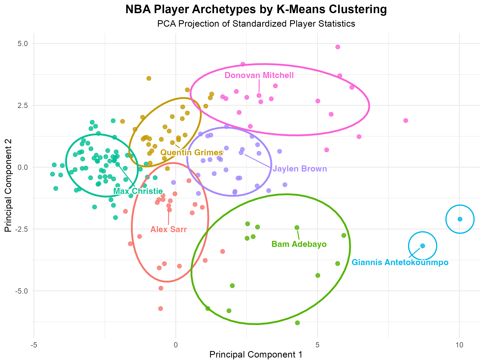

# NBA Player Archetypes Using Unsupervised Learning

This project uses unsupervised learning to identify NBA player archetypes from standardized player performance statistics. Instead of relying on predefined positions or subjective player comparisons, the analysis groups players by statistical similarity and interprets each cluster as a basketball role.

The goal is to show how clustering can turn high-dimensional sports data into interpretable player profiles, connecting statistical patterns with familiar NBA playing styles.

## Research Question

**Can NBA players be clustered into distinct archetypes based only on their standardized statistical profiles, such that each cluster represents a coherent style of play or functional role?**

## Dataset

The project uses `data/raw/nbastats.csv`, a player-level NBA statistics dataset for the **2024-2025 regular season**. Each row represents a player-season record with box score and advanced performance variables.

To make the clusters more stable and interpretable, the analysis filters the player pool to players with meaningful rotation-level involvement:

- At least **41 games played**
- At least **24 minutes per game**
- One row per player, keeping the record with the highest total minutes when a player appears multiple times because of a mid-season trade

## Methods

The analysis follows a reproducible clustering pipeline:

1. **Load and inspect the data**
2. **Clean the player table and filter the cohort**
3. **Separate metadata from model inputs**
4. **Select numeric performance features**
5. **Standardize features using z-scores**
6. **Choose the number of clusters using elbow, silhouette, and gap statistic diagnostics**
7. **Fit a final k-means model with `k = 7`**
8. **Use PCA to visualize clusters in two dimensions**
9. **Profile clusters using mean standardized feature values**
10. **Assign interpretable basketball archetype labels**

K-means was chosen for interpretability: once features are standardized, each cluster centroid can be read as an archetypal statistical profile.

## Results

The final model identifies **seven player archetypes**:

| Cluster | Archetype | Players |
| ---: | --- | ---: |
| 1 | Defensive Rim Protectors | 22 |
| 2 | Perimeter Shooters and Secondary Guards | 30 |
| 3 | Interior Bigs | 12 |
| 4 | Low-Usage Role Players | 67 |
| 5 | Superstar Offensive Hubs | 2 |
| 6 | Versatile Two-Way Forwards | 28 |
| 7 | Primary Shot Creators | 19 |

Each archetype reflects a combination of statistical tendencies rather than one defining metric. For example, Primary Shot Creators and Superstar Offensive Hubs are both high-offense groups, but they differ in the balance of scoring volume, playmaking, usage, and broader contributions.

## Visualization

The PCA plot below projects the standardized feature matrix into two dimensions for visualization. Clustering was performed in the full standardized feature space, not on the PCA projection.



## Repository Structure

```text
.
├── README.md
├── nba_player_archetypes.ipynb
├── data/
│   └── raw/
│       └── nbastats.csv
├── scripts/
│   ├── 01_check_load.R
│   ├── 02_clean_build_matrix.R
│   ├── 02_inspect_columns.R
│   ├── 03_choose_k.R
│   ├── 04_kmeans_final.R
│   ├── 05_pca_cluster_plot.R
│   └── 06_cluster_profile.R
└── output/
    ├── figure/
    │   ├── k_elbow_wss.png
    │   ├── k_gap_statistic.png
    │   ├── k_silhouette.png
    │   └── nba_player_clusters.png
    └── tables/
        ├── cluster_names.csv
        ├── cluster_profiles.csv
        ├── cluster_signatures.csv
        ├── player_clusters.csv
        ├── player_clusters_named.csv
        └── top_features_per_cluster.csv
```

## How to Run

The project can be reviewed through the notebook:

```text
nba_player_archetypes.ipynb
```

The analysis scripts can also be run in order from the project root:

```r
source("scripts/01_check_load.R")
source("scripts/02_clean_build_matrix.R")
source("scripts/03_choose_k.R")
source("scripts/04_kmeans_final.R")
source("scripts/05_pca_cluster_plot.R")
source("scripts/06_cluster_profile.R")
```

The R scripts use packages including `tidyverse`, `factoextra`, and `ggrepel`.

## Key Takeaways

- NBA players can be grouped into interpretable archetypes using standardized statistical profiles.
- The clusters align with recognizable basketball roles even though the model does not use subjective player labels.
- Archetypes are best understood as statistical tendencies rather than fixed player identities.
- Some overlap between clusters reflects the fluidity of modern NBA roles, especially among guards, wings, and versatile forwards.

## Limitations and Future Work

- The analysis uses a single season, so archetypes may shift across years.
- K-means assumes relatively compact and spherical clusters, which may simplify the true structure of NBA roles.
- Feature selection influences the resulting archetypes.
- Team context, coaching strategy, lineup fit, and player tracking data are not included.

Future extensions could compare archetypes across multiple seasons, incorporate player tracking data, test alternative clustering methods, or study how players move between archetypes over time.
